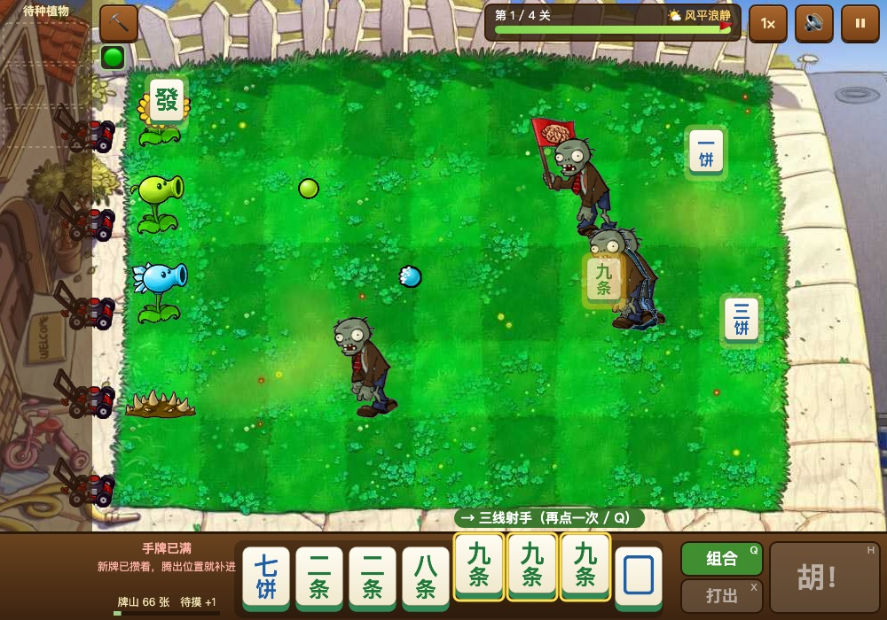

# 植物麻将 · 肉鸽塔防

**用麻将凑牌代替阳光来种植物的塔防小游戏**：摸牌 → 凑顺子 / 刻子种植物 → 凑成胡牌攒一发全屏大招。原生 JS，无构建，浏览器直接玩。

> 这是一个 **AWS AI-DLC（AI-Driven Development Life Cycle）学习展示项目**：在一个开源 H5 塔防游戏的基础上，用 AI 驱动的开发流程完成"麻将经济"玩法改造。开发过程文档见 [`docs/aidlc/`](docs/aidlc/README.md)。

> ⚠️ 本项目基于 [yangyunhe369/h5-game-plantsVSzombies](https://github.com/yangyunhe369/h5-game-plantsVSzombies)（MIT）二次开发，详见文末[来源与致谢](#来源与致谢)。游戏美术版权归 PopCap / EA 所有，**仅供学习交流，不得商用**。



## 快速开始

```bash
npm start      # python3 -m http.server 8080，然后打开 http://localhost:8080
npm test       # 麻将核心逻辑单元测试（node --test，需要 Node 18+）
```

URL 加 `?seed=123` 可以固定牌山，方便复现。

## 怎么玩

- **凑牌种植物**：选中 3 张组成面子（顺子或刻子）→ 生成待种植物（最多暂存 3 个）→ 点草坪种下。
  - 条 = 攻击（射手类），饼 = 防御（坚果、地刺、土豆地雷），萬 = 功能（向日葵、大嘴花、窝瓜；萬刻子是立即摸 2 张），中发白刻子 = 爆发。
  - 中发白的对子也能打出，效果减半。
  - 能组成的面子会用彩色框提示；点一张牌自动选中它所在的面子，再点一次就组合。
- **胡牌大招**：手牌凑成 2 面子 + 1 雀头（或 4 对子）自动存成大招，按 `H` 释放，对全场僵尸造成 `300 × 番数` 伤害（强化可加成，对 Boss 最多造成 30% 最大生命）。"一大波僵尸"预告之后释放额外 ×1.5；场上没有僵尸时不能释放。
- 第 1 关不放萬字牌，每关开局赠送向日葵 + 豌豆射手。

| 按键 | 作用 |
|---|---|
| `Q` / `Enter` | 组合选中的牌 |
| `X` / `Delete` / `Backspace` / 右键手牌 | 打出 |
| `H` | 释放胡牌大招 |
| `1`–`3` | 选择待种植物 |
| `T` | 开关面子提示 |
| `S` | 铲子 |
| `F` | 2 倍速 |
| `M` | 静音 |
| `Space` | 暂停 |
| `Esc` / 右键空白处 | 取消选择 |

## 相对原项目改了什么

| 分支 / 标签 | 内容 |
|---|---|
| `upstream-v1.2` | 原作者的最后版本（未改动） |
| `baseline-roguelike` | 此前本地做的"肉鸽版"：重写引擎（实体 / 数据 / UI / 合成音效）、4 关与关卡特性、强化三选一、导入新素材。作为本次改造的基线 |
| `mahjong`（默认分支） | 本次 AI-DLC 改造：麻将手牌系统替代阳光经济 |

主要新增 / 改动：

- `js/mahjong.js`（新增）：纯逻辑的牌山、面子识别、胡牌回溯拆解、听牌、番型计算，浏览器和 Node 共用
- `tests/mahjong.test.js`（新增）：17 项单元测试
- `js/game.js` / `js/data.js` / `js/ui.js` / `js/entities.js`：阳光与卡片冷却 → 手牌、待种植物槽、胡牌储备；数值与强化池改写
- `js/assets.js` / `index.html` / `css/style.css` 等：牌面程序化绘制、底部手牌托盘
- `docs/PLAN.md`：执行计划与每轮调整记录

完整差异：`git diff upstream-v1.2..mahjong`，或只看本次改造：`git log baseline-roguelike..mahjong`。

## 目录结构

```
.
├─ index.html          页面骨架与脚本加载顺序
├─ package.json        npm start / npm test
├─ css/                样式
├─ images/             图片素材
├─ js/
│  ├─ mahjong.js       麻将核心逻辑（纯函数，可单测）
│  ├─ data.js          数值表：植物、僵尸、关卡、强化、麻将参数 MJ
│  ├─ game.js          主循环、关卡流程、输入、绘制
│  ├─ entities.js      植物、僵尸、子弹、掉落牌等实体
│  ├─ ui.js            HUD、三选一、暂停、结算
│  ├─ assets.js        素材加载与牌面程序化绘制
│  ├─ manifest.js      素材清单（由 tools/import_assets.py 生成）
│  ├─ audio.js         Web Audio 实时合成的音效与音乐
│  └─ fit.js / main.js 屏幕适配、入口
├─ tests/              单元测试
├─ tools/              素材导入脚本
├─ .github/workflows/  CI：自动运行测试
└─ docs/
   ├─ PLAN.md          执行计划
   └─ aidlc/           AI-DLC 过程文档
```

## 来源与致谢

- 原始游戏：[yangyunhe369/h5-game-plantsVSzombies](https://github.com/yangyunhe369/h5-game-plantsVSzombies)，作者 弦云孤赫（David Yang），MIT License。本仓库保留了原项目的完整提交历史。
- 部分僵尸 / 植物素材：通过 `tools/import_assets.py` 从 [marblexu/PythonPlantsVsZombies](https://github.com/marblexu/PythonPlantsVsZombies) 导入。
- 《植物大战僵尸》名称与美术版权归 PopCap Games / Electronic Arts 所有。音效和音乐由 `js/audio.js` 实时合成，不使用原版音频。本项目为非商业的学习展示，不提供任何商业用途授权。

## License

代码部分以 [MIT](LICENSE) 发布，美术素材不在授权范围内（见上）。
